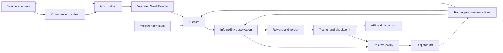

# InfernoTactics architecture

## What the system does

InfernoTactics turns a geographic area into a simulation-ready world, starts one
or more fires, advances those fires under terrain/fuel/weather effects, and lets a
decision policy deploy finite emergency resources. The learning objective is not
just to extinguish cells: it balances containment speed, property and population
risk, dispatch cost, travel delay, evacuation, and preventative firebreaks.

The project is a research simulator, not an operational wildfire forecast or an
incident-command system. Its outputs are only as credible as the calibration and
validation of its simplified physical and operational assumptions.

## Runtime flow



Each simulation tick follows one ordered transaction:

1. advance already-dispatched units and apply any effects that have arrived;
2. validate and commit new dispatches;
3. obtain weather for the current simulated time;
4. advance fire spread once;
5. score newly destroyed buildings and successful firebreak contacts;
6. apply active-fire and dispatch costs;
7. emit the next observation, reward decomposition, events, and terminal state.

This order matters. A resource arriving this tick acts before the fire advances;
a resource dispatched this tick does not act immediately.

## Geographic data and world construction

The configured study area spans the Palisades/Topanga-to-Westwood region. Source
adapters are intentionally separate from raster construction:

| Layer | Current source | Role |
| --- | --- | --- |
| Elevation | USGS 3DEP | Elevation and derived slope |
| Fuel model | LANDFIRE LF2024 FBFM40 | Relative per-cell ignitability |
| Buildings | LA GeoHub building footprints | Structure density/height and loss scoring |
| Roads | OpenStreetMap through OSMnx | Road resistance and resource routing |
| Population | WorldPop 2020 | Population-sensitive loss and rescue value |
| Weather | NOAA ASOS KSMO observations | Wind and humidity time series |
| Stations | Version-controlled LAFD roster | Unit types, counts, and dispatch origins |

`build_manifest.py` records the provider, product, retrieval endpoint, byte size,
and SHA-256 hash of every required source asset. `grid_builder.py` reprojects and
rasterizes the sources to one EPSG:5070 grid and writes:

- `grid_static.npy`: `(8, height, width)` float32 raster stack;
- `grid_meta.json`: layer order, extent, transform, CRS, cell size, and fuel source;
- `source_manifest.json`: source provenance and integrity hashes.

The static channels, in contract order, are elevation, slope, building density,
building height, road mask, fuel density, water mask, and population density.
`WorldBundle.load()` validates dimensions, layer order, finite values, metadata,
and computes a combined world fingerprint before the simulator can start.

FBFM40 categories are currently mapped to explicit relative ignitability values.
That is a much better input than the former elevation/road heuristic, but it is
still an adapter rather than a calibrated Rothermel implementation. Roads reduce
fuel and also apply a separate spread-resistance multiplier; water is forced to
zero ignitability.

## Fire model

`FireSim` is a stochastic, synchronous cellular automaton. Every cell is in one of
five states:

- `Safe`: non-burning and non-ignitable, including water and completed trenches;
- `Fuel`: available to ignite;
- `Threat`: ignited front that becomes blaze on the next tick;
- `Blaze`: actively burning and able to ignite neighbors;
- `Burned Out`: consumed fuel.

For each of the eight neighboring directions, a fuel cell receives an ignition
probability based on:

```text
0.22 * ignitability * slope_factor * wind_factor * road_resistance * humidity_factor
```

Independent neighbor contributions are combined as `1 - product(1 - p_i)`.
Slope accelerates uphill spread using an exponential factor clipped to `[0.15,
4.0]`. Wind uses the meteorological "direction from" convention, is converted once
to a downwind Cartesian/grid vector, and applies an exponential alignment factor
with the same clip. Humidity can suppress the base probability by up to 85%.

Blaze cells can also launch stochastic embers downwind. At the 40 mph reference
wind, the modeled jump range reaches 4-12 cells (about 120-360 m), with lateral
jitter. The automaton is reproducible for a fixed seed, not deterministic across
different seeds.

## Operations and containment

`InfernoEnv` coordinates the fire engine, finite station roster, and road network.
The resource inventory and its available -> preparing -> traveling -> setup ->
deployed -> available lifecycle live in the independent `ResourceFleet` state
machine. Routing and on-arrival fire effects enter that state machine through
callbacks, so fleet behavior can be tested without loading a raster or road graph.
The map is partitioned by the shared domain function into 4 x 8 macro-zones. The
same exact boundaries are used by routing, target resolution, and CNN zone pooling.

Ground units use shortest travel-time paths on the projected OSM road graph.
Synthetic traffic applies road-class load/capacity and a BPR-style multiplier;
currently traveling ground units contribute to congestion. Helicopters use
straight-line travel at 60 m/s and have a longer reload cycle.

Resource effects are local disks around a selected point within the target zone:

- water teams and helicopters suppress active cells;
- trench crews convert eligible fuel to safe firebreak cells;
- rescue vehicles mark threatened building cells as evacuated.

Each unit moves through availability, preparation/travel, arrival setup, effect,
and post-effect busy/reload states. A full episode is at most 150 two-minute ticks.

The reward includes:

- `+50` per successful water/helicopter suppression event;
- `-0.5` per Threat or Blaze cell per tick;
- population-weighted building loss (`-100` to `-400` per building cell);
- a 50%-90% loss reduction for previously evacuated building cells;
- resource-specific dispatch costs;
- travel/response-delay cost;
- `-10` for invalid or ineffective resource use;
- `+2` once for each explicit trench cell first contacted by the fire while it
  remains safe.

The environment returns every component separately for diagnosis. The sum is the
learning reward.

## Policy and learning

The observation contains nine raster channels (the eight static layers plus fire
state) and eleven scalar values: weather, available units, elapsed time, and
traffic state.

The model has four parts:

1. a shallow full-resolution CNN creates 32 per-cell features;
2. a downsampled CNN branch creates a 128-value global map representation and
   averages features within each canonical macro-zone;
3. an MLP embeds the scalar state;
4. actor/value/auxiliary heads choose resources, score targets, value the state,
   and forecast the next tick's fire-state classes.

Instead of memorizing absolute zone IDs, the target head scores six semantic
candidates for each resource:

1. largest active fire;
2. downwind fire front;
3. adjacent fuel ahead of the fire;
4. highest threatened population;
5. nearest reachable active fire;
6. no dispatch.

Candidate features include validity, active/adjacent counts, threatened
population, fuel/building density, travel time, normalized location, and whether
active fire is present. Invalid candidates are masked, but the no-dispatch target
is always selectable. A tick can produce multiple dispatches until the policy
selects no-dispatch or runs out of resources.

Training is Monte Carlo actor-critic with value, entropy, auxiliary semantic-target,
and one-step fire-state forecast losses. Rollouts store the exact resolved targets
and features used during action selection, preventing training from reconstructing
a different action context later.

Version-2 checkpoints contain the model, optimizer, return normalizer, NumPy and
PyTorch random state, completed episode, metadata, and world fingerprint. Legacy
weight-only checkpoints still load, but they cannot prove world compatibility.

## Implemented source layout

The executable implementation now lives under one installable package:

```text
infernotactics/src/
  infernotactics/
    api/                         supported FastAPI application
    data/                        source acquisition, configuration, provenance
    domain/                      actions, observations, fire/resource/weather contracts
    operations/                  environment, fleet, routing, traffic, effects, weather
    policy/                      heuristic, inference, targets, neural models
    service/                     bounded, thread-safe simulation session ownership
    simulation/                  fire engine implementation and protocol
    validation/                  observed-perimeter validation workflow
    visualization/               browser export and packaged playback assets
    world/                       world build/load/validation/fingerprints
    training/                    trainer, evaluation, logging, plots, checkpoints
infernotactics/tests/
  unit/                          fast isolated domain/service/physics tests
  integration/                   environment and API boundary tests
infernotactics/scripts/
  diagnostics/                   manual visual/performance diagnostics
infernotactics/data/
  visualization/                 generated browser-facing map subsets
infernotactics/models/
  containment_policy_v10.pt      bundled policy used by both APIs
```

The core API (`infernotactics.api.server`) owns live, isolated simulation
sessions. The playback API (`infernotactics.api.playback`) is a separate adapter:
it runs an episode with the matching bundled checkpoint, converts internal state
to a compact visualization timeline, and serves the Cesium interface and its 3D
assets from `infernotactics.visualization.static`. Both use the same canonical
simulator, environment, policy, and training contracts.
